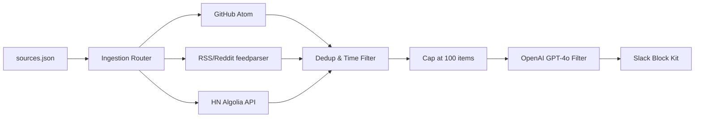

# SIA – AI Development Update

A zero-cost, fully automated Python pipeline that aggregates AI coding news, filters it through OpenAI, and posts a high-signal daily digest to Slack.

## Overview

The pipeline executes daily via GitHub Actions. It ingests data from four source categories, deduplicates items, caps them to the top 100 recent entries, and uses `gpt-4o` to filter down to the 5 most critical technical updates.

### Supported Sources (`sources.json`)
The ingestion targets are fully decoupled from the code. Edit `sources.json` to add or remove targets without changing any Python logic.

- **`github_releases`**: Watches tags/releases (e.g., `cursor/cursor`, `anthropics/claude-code`) via Atom feeds.
- **`rss_feeds`**: Ingests standard RSS/Atom feeds (e.g., GitHub Copilot blog, Simon Willison's blog).
- **`reddit_searches`**: Uses Reddit's `.rss` search endpoints to track specific keywords.
- **`hn_queries`**: Queries the Algolia Hacker News API for specific tools or topics.

_All feeds are filtered to only include items from the last 28 hours to prevent stale news._

## Configuration

To activate the automated pipeline, set the following secrets in your GitHub repository (`Settings` → `Secrets and variables` → `Actions` → `New repository secret`):

| Secret | Description |
|--------|-------------|
| `OPENAI_API_KEY` | Your OpenAI API key (requires access to `gpt-4o`) |
| `SLACK_WEBHOOK_URL` | An Incoming Webhook URL from a Slack App |

## Architecture



## Local Development

If you want to run or test the pipeline locally:

1. Clone the repository and navigate into it.
2. Create a virtual environment and install dependencies:
   ```bash
   python3 -m venv .venv
   source .venv/bin/activate
   pip install -r requirements.txt
   ```
3. Create a `.env` file in the root directory:
   ```env
   OPENAI_API_KEY=sk-your-key
   SLACK_WEBHOOK_URL=https://hooks.slack.com/services/YOUR/WEBHOOK/URL
   ```
4. Run the pipeline:
   ```bash
   python pipeline.py
   ```
